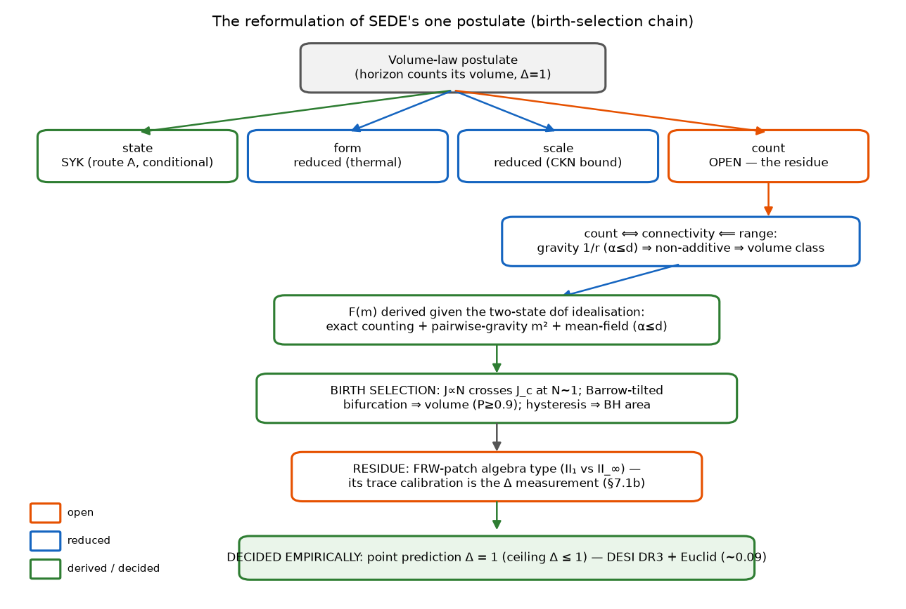
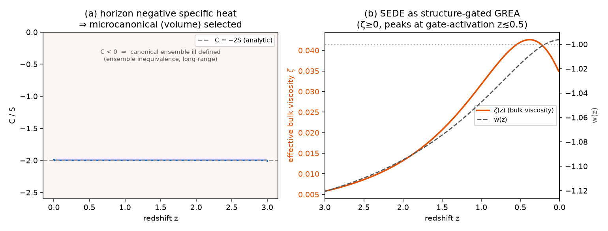
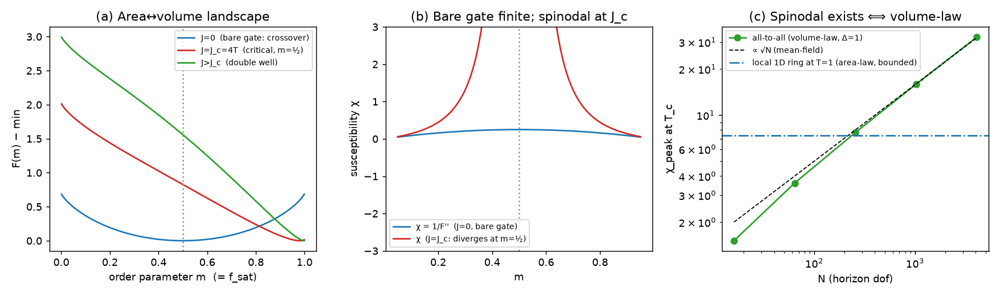
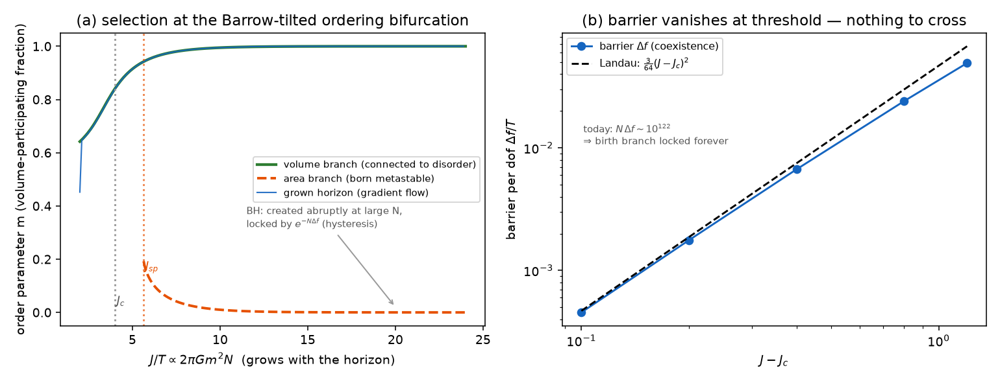

# Is the volume-law horizon a postulate or a consequence? A reduction to a driven non-equilibrium conjecture for Structural Entropy Dark Energy

*(Companion to "Structural Entropy Dark Energy" (the cosmology paper [@Pandev:2026cosmology]). All quantitative claims are reproduced by
the accompanying code, each with validation assertions. The cosmological results of the cosmology paper stand
independently of the reduction attempted here.)*

## Abstract

Structural Entropy Dark Energy (SEDE) reproduces the cosmological data with no fitted
dark-sector parameter, at the price of one foundational input: the cosmic apparent horizon
carries volume-law entropy (Barrow exponent Δ = 1) — scaling with the enclosed volume rather than the
boundary area. We ask how
much of that input is irreducible. The postulate decomposes into *state, form, scale,* and
*count*; state, form and scale are first-principles or reducible given the standard
identification of the gravitational horizon entropy with an entanglement entropy — with the caveat,
stated up front, that a *volume*-law coefficient (unlike the area law's universal $A/4G$) is
state-dependent, so *scale* reduces only *given* the Bousso-saturated horizon state that fixes $s_{\rm grav}$:
a conditional, not a universal coefficient. That leaves the
bulk-versus-boundary count as the residue — which a Bekenstein no-go shows cannot follow
from any energy bound. We then analyse the *selection* of the volume branch dynamically, as a
**motivated conditional** rather than a derivation: because gravity's long-range cooperative coupling
clears the ordering threshold only with a size-dependent ratio, the two-phase free energy did not exist
at the horizon's birth; grown continuously from Planckian size, the horizon passes *through* the ordering
bifurcation with Barrow entropy tilting the nascent well toward volume, so Δ = 1 is *favoured* at birth,
and long-range hysteresis locks each horizon to its birth branch — the cosmic horizon to volume, an
abruptly-formed black hole to area. We are explicit about the limits of this argument: the tie-breaking
tilt is itself the Barrow-Δ = 1 free energy, the two-well landscape presupposes an accessible volume
phase, the mean-field treatment is extrapolated to the N ∼ O(1) quantum-gravity regime where its tools
are not controlled, and the one concrete model of de Sitter holography (double-scaled SYK) currently
maps to the *area* branch — so the mechanism relocates and narrows the postulate, it does not eliminate
it. Its lasting value is to convert an untestable counting postulate into a falsifiable one: a
pre-registered point prediction Δ = 1, tested to a forecast σ(Δ) ≈ 0.09 by DESI DR3 + Euclid. On public data the contrast is already sharp — in a *profile*-likelihood analysis (the marginalised
posterior awaits DR3+Euclid) the structure-gated family *prefers* the
volume endpoint (Δ = 0.93 [0.83, 1.02]) that the un-gated Barrow family pays Δχ² ≈ 2400 to reach.
The marginalised model-level statement is more modest: at equal parameter count the zero-parameter Δ = 1
model is favoured over ΛCDM at the cosmology paper's ΔDIC ≈ −3 (a point-fit gives Δχ² ≈ 2.9, but the
DIC is the honest headline). The
cosmological results of the cosmology paper stand independently of the reduction attempted here.

**Keywords —** horizon thermodynamics; generalised entropy; Barrow entropy; holographic dark energy; de Sitter holography; entanglement entropy; non-equilibrium statistical mechanics; entropic gravity; dark energy.

---

## 1. Introduction

Horizon thermodynamics is the most robust pointer we have toward the microscopic structure of
gravity. The first law on a causal horizon yields the Einstein equations [@Jacobson:1995ab], the
apparent-horizon first law yields the Friedmann equations [@Cai:2005ra], and the
Bekenstein–Hawking area law S = A/4 organises black-hole and cosmological thermodynamics
alike. Yet the area law is an assumption about a *state*: it is the entanglement entropy of a
particular (ground-like) horizon state, and generalisations — Tsallis–Cirto non-extensive
entropy, Barrow's fractal-horizon S ∝ A^{1+Δ/2} [@Barrow:2020tzx], and the holographic
dark-energy programme built on them [@Saridakis:2020zol] — explore what happens when that
assumption is relaxed.

Structural Entropy Dark Energy (SEDE; the cosmology paper [@Pandev:2026cosmology]) is one such model, distinguished by sourcing
dark energy from horizon entropy *gated by structure growth*, ρ_DE = T_AH s_grav f_sat(z).
Following the cosmology paper, this is *holographic* dark energy — ρ_DE is added as a single fluid to an
otherwise standard-GR Friedmann equation, not a Barrow-*modified*-gravity cosmology in which the horizon
entropy reshapes the background; the volume-law entropy sources ρ_DE alone (so the modified-gravity
Barrow/BBN bounds do not apply, and the postulate examined below is one of *state*, not of dynamics).
Its appeal is that the entire dark sector adds no *fitted* parameter once Ω_m and the one postulate are fixed:
the H-coupling λ = 1−Δ/2 = ½, the equation of state, the structure coupling γ, and the sound
speed all follow. The one input is the **volume-law postulate**: the horizon entropy is the
volume-law (Δ = 1) entanglement entropy, not the area law. The cosmology paper states plainly that this
is the model's single irreducible assumption, motivated but not derived, and that it is
falsifiable — Δ is measured by upcoming surveys.

This paper asks the prior question: *how irreducible is it, really?* We are not trying to
solve quantum gravity; we are trying to determine the minimal, sharply-posed statement that
the cosmology actually rests on, and to reduce everything reducible to it. The result is a reformulation — one that ends with a shorter, sharper list of residuals than the postulate it replaces. We trade a static, untestable counting postulate for a physical picture in which Δ = 1 is selected *at the horizon's birth*, carried through the ordering bifurcation that gravity's N-dependent coupling (J/J_c = 2πGm²N) forces at Planckian size, with Barrow's entropic tilt breaking the tie and exact long-range hysteresis locking every horizon to its birth branch. The remaining hand-off to de Sitter holography is sharpened to a single algebraic question — the type, II₁ or II_∞, of the FRW static-patch observer algebra. Several steps borrow established machinery: the Cohen–Kaplan–Nelson
holographic energy bound [@Cohen:1998zx] for the scale; the Page curve and
eigenstate thermalisation for the state; the Campa–Dauxois–Ruffo classification of long-range
systems [@Campa:2009jxa] for the connectivity; Ryu–Takayanagi min-cut for the
count↔connectivity link; and the double-scaled Sachdev–Ye–Kitaev (SYK)/de Sitter correspondence
[@Susskind:2021esx; @Narovlansky:2023lfz] for the closure attempt. The contribution is the
chain, and the precise localisation of what remains open.

Throughout, every quantitative claim is a runnable experiment that the accompanying code runs with
validation assertions.

**Figure 1.** The reduction in outline. The volume-law postulate splits into *state*, *form*,
*scale* and *count*; the first three are derived or reduced (green/blue) and the count is the residue
(orange). The count reduces through connectivity and interaction range to a birth-branch selection:
the N-dependent coupling carries the grown horizon through the ordering bifurcation onto the
Barrow-tilted (volume) branch, where long-range hysteresis locks it (a *state-selection* hysteresis
of the entropy branch — distinct from the unrelated "cosmological hysteresis" of cyclic
cosmologies, which refers to the $\oint p\,\mathrm{d}V$ loop), leaving a single
dS-holography question that the Δ measurement decides empirically. Each box names the experiment that
establishes it.

### 1.1 Relation to prior work

SEDE sits at the confluence of several programmes, and its closest relative deserves explicit
positioning.

Entropy-production cosmic acceleration (GREA). The General Relativistic Entropic Acceleration
theory of García-Bellido and Espinosa-Portalés [@Garcia-Bellido:2021idr; @Espinosa-Portales:2021cac] is the nearest
existing model: it too abandons Λ, sources the late-time acceleration from cosmic-*horizon*
entropy, takes the Helmholtz free energy F = U − TS (not matter alone) as the gravitational
source, and makes the breaking of time-reversal by *entropy production* the engine of
acceleration. We regard GREA as prior art for "acceleration from horizon entropy production
without Λ", and our driven-NESS picture (§4–6) is conceptually continuous with it. The
differences are sharp and testable: (i) GREA uses the boundary (area) horizon entropy and a
single parameter α (the horizon-to-curvature ratio), whereas SEDE's defining claim is the
volume entropy (Δ = 1) — precisely the counting residue this paper isolates; (ii) GREA's
entropy growth is driven by the horizon's own *expansion*, whereas SEDE's is *gated by structure
formation* (the f_sat factor), which locks w(z) to the growth history and yields a phantom
crossing rather than GREA's quintessence-like w(a); (iii) SEDE's dark sector adds no *fitted* parameter.
Notably, were SEDE's residue to resolve to the *area* branch (Δ = 0), its phenomenology would
collapse toward GREA's — so the Δ measurement (§7) that decides SEDE's residue also discriminates
the two models. A holographic reading of GREA has recently appeared [@GarciaBellido:2025grea], and a
broader open-system view of gravitational non-equilibrium thermodynamics is developing
[@Farooq:2011zz; @AguiSalcedo:2025open]; SEDE's contribution to that line is the reduction of the
volume-law *counting* input to a driven steady state. The connection is also quantitative: GREA's
entropy production maps to an effective bulk viscosity with negative pressure, and SEDE's
structure-driven entropy production d ln f_sat/d ln a > 0 maps to a *positive* (second-law-respecting)
effective bulk viscosity ζ(z) = ρ_DE (d ln f_sat/d ln a)/(9H) that peaks at the structure-formation
epoch rather than tracking the horizon expansion; the w = −1 crossing is the
GREA negative-pressure balance, structure-timed. SEDE is, in this sense, a *structure-gated* member of
the GREA/entropic-dark-energy family — the gate being exactly what makes its w(z) lock to the growth
history (the §5 phase-lock) rather than to the horizon's own size.

**Figure 2.** Two consequences drawn from the new literature. *(a)* The de Sitter horizon has negative
specific heat (C = −2S); with gravity strongly long-range this makes the ensembles inequivalent and the
canonical (area-law) accounting ill-defined, selecting the microcanonical (volume) branch (§4). *(b)*
SEDE's structure-driven entropy production maps to a positive (second-law) effective bulk viscosity
ζ(z) that peaks at the gate-activation epoch (z <∼ 0.5; it tracks d ln f_sat/d ln a, not the z≈2 star-formation peak), casting SEDE as a structure-gated member of the
GREA/entropic-dark-energy family; w(z) crosses −1 at the viscous–dilution balance.

Holographic dark energy and generalised entropy. SEDE is, at the background level, a
structure-gated Barrow holographic dark energy in the lineage founded by Li [@Li:2004rb]: the CKN bound [@Cohen:1998zx] fixes the scale, Barrow's fractal-horizon entropy
[@Barrow:2020tzx] and its holographic-DE use [@Saridakis:2020zol] fix the form (the λ = 1 − Δ/2 relation is
Saridakis's; our increment is the Δ = 1 selection, not that relation), and the Tsallis–Cirto
non-extensive entropy [@Tsallis:2012js] supplies the δ ↔ Δ map. The CKN-vs-area-vs-volume tension
these inputs create is mapped by Manoharan [@Manoharan:2025]; our addition is the *derivation*
question — which of these inputs is irreducible — and the answer that only the count is.

Horizon thermodynamics and entanglement. The first-law derivations of Einstein
[@Jacobson:1995ab] and Friedmann [@Cai:2005ra] equations underlie the construction; the
entanglement-equilibrium refinement [@Jacobson:2015hqa] is the basis of route B; the Ryu–Takayanagi
min-cut [@Ryu:2006bv] supplies the count ⟺ connectivity link; and the volume-law =
thermal identification rests on eigenstate thermalisation [@Deutsch:1991msp; @Srednicki:1994mfb; @Rigol:2007juv].

**de Sitter holography.** The residue — "dim 𝓗(static patch) = e^{Area} or e^{Vol}?" — is posed in
the language of de Sitter holography [@Strominger:2001pn; @Banks:2000fe] and is the target of the
double-scaled-SYK/de Sitter correspondence [@Susskind:2021esx; @Narovlansky:2023lfz; @Lin:2022rbf], which we use in the closure attempt (§7). The maximal-scrambler state invokes the
chaos bound [@Maldacena:2015waa] and SYK random-matrix universality
[@Cotler:2016fpe].

Many-body and complexity inputs. The long-range/non-additivity classification is
[@Campa:2009jxa], and the α-controlled volume↔area (and intermediate/fractal) crossover of long-range
entanglement entropy is already characterized in the literature [@Vitagliano:2010db; @Solfanelli:2023vav; @Chakraborty:2023mrw; @J:2025waa]
— the known crossover we apply to a horizon count (§ the count companion), not a new phenomenon.
The prototype's free-fermion *negative* (volume-law needs interactions, not free transport) is
consistent with the monitored free-fermion entanglement literature [@Fisher:2022qey], and that
genuine volume-law non-equilibrium steady states exist is established in driven many-body
systems [@Ippoliti:2021fjy] — a condensed-matter precedent for, not a derivation
of, the driven-NESS we invoke.

Structure-sourced dark energy. The general idea that dark energy is sourced by cosmic structure
predates SEDE in several distinct mechanisms: Gough's information dark energy (≈2008); the
spacetime-fragmentation/"FRW-islands" proposal of Hossain [@Hossain:2007ma]; and the cosmological-backreaction
and averaging programme (Buchert; Wiltshire's timescape). SEDE's cosmology paper credits and distinguishes
these. What is specific to SEDE — and, to our knowledge, without precedent — is the *combination*
the present paper analyses: the source is the volume-law horizon entropy (Δ = 1, a counting
claim), it is driven by structure through the f_sat gate, and the dark sector adds
no *fitted* parameter. The closest entropic relative remains GREA (above), which differs in using the
boundary (area) entropy. A systematic priority search returned no work combining these three
elements; this paper concerns that horizon-entropy foundation. The most recent independent
convergence is Pandey [@Pandey:2026], who obtains late-time acceleration and suppressed
growth from the *configuration entropy* of the collapsing matter field as a backreaction within GR —
reaching SEDE's qualitative conclusion by a different route (matter-sector entropy, not the horizon;
no derived w-crossing; no Δ), which we welcome as corroboration of the direction. A parallel
generalised-mass-to-horizon-entropy programme [@Shameeem:2026; @Mondal:2026] links a modified horizon entropy to growth via a *modified-Friedmann* route,
and so inherits the BBN Δ-bounds that SEDE's holographic-fluid scope evades.

## 2. The postulate, decomposed

"Volume-law" conflates four claims of very different status:

- state — the horizon degrees of freedom are maximally entangled (thermal), not in a
 low-entanglement ground state;
- form — the entropy scales as the volume, S ∝ V;
- scale — the magnitude is ρ_DE ∼ ρ_crit, not ρ_Planck;
- count — the *number* of horizon dof grows as the bulk (N ∝ R^{d−1}) rather than the
 boundary (N ∝ R^{d−2}).

Since S ∼ (state factor) × N and the Barrow deformation enters as S ∝ A^{1+Δ/2} ∝
R^{(d−2)(1+Δ/2)}, the exponent Δ is fixed by the count (area → Δ=0, volume → Δ=1 in d=4);
the state only sets whether the prefactor is maximal. So the postulate's empirical content —
Δ — is the counting claim, and the other three are separable. The rest of the paper derives or
reduces state, form and scale, and isolates count.

## 3. How derivable is the postulate? The route map

> The horizon-entropy identification (assumed, not discharged). Routes A/B below characterise the
> *matter-field subsystem entanglement entropy* S_ent (Page/ETH/SYK) — UV-divergent, species-dependent.
> The dark sector is sourced by the *gravitational horizon entropy* S_grav = A/4G (Cai–Kim/Jacobson) —
> UV-finite, geometric. S_ent ≡ S_grav is a long-standing open problem in quantum gravity
> ([@Bombelli:1986rw; @Susskind:1994sm]), established only for the Rindler vacuum. We adopt
> it (the induced-gravity premise) and flag every dependent step as conditional. In particular Route A
> fixes the entropy *prefactor* (maximal scrambling), which is orthogonal to the bulk-vs-boundary
> *exponent* that is the count; and Route B's "volume-law is generic" is a statement about S_ent, not
> S_grav. Accordingly the *state*, *form*, and residue-to-range steps are argued only conditionally
> on S_ent = S_grav — not established outright.

Five routes (`run_deriv_{A..E}_*.py`):

A — de Sitter holography / maximal scrambler. A Majorana-SYK
diagonalisation confirms the horizon *state* is maximally entangled / volume-law: chaotic
level statistics (⟨r⟩ ≈ 0.71) and Page-value saturation [@Page:1993df] (S/S_Page ≈ 0.99). But SYK is
all-to-all / geometry-free and cannot pose the bulk-vs-boundary count; the count is the genuine
open dS-holography sub-target.

B — entanglement first law in a thermal state. Jacobson's derivation gets
the area-law Einstein equations from maximal entanglement of the *vacuum*. Redone around a
*thermal* (de Sitter Gibbs) reference, the entanglement entropy acquires a volume term that
dominates the area term once the region exceeds the thermal length λ_th = 1/T. Volume-law is
thus the generic thermalised behaviour, not exotic. At the de Sitter temperature alone the
horizon sits just on the area side (R_H/λ_th = 1/2π); volume-law dominance requires
thermalisation above the de Sitter bath (toward Planck = maximal scrambling), whereupon the
density is Planckian — the CKN scale. So the *form* reduces to thermalisation, leaving the
*scale* to CKN.

C — Verlinde emergent gravity. A volume-law de Sitter entanglement
entropy is exactly what Verlinde's emergent-gravity programme invokes for apparent dark
matter; one volume-law scale gives both ρ_DE ∼ ρ_crit and a₀ = cH₀/2π (≈ 0.87× the
radial-acceleration-relation value). A unification motivation that ties the postulate to an
independent anomaly; it inherits that programme's open issues.

D — gravitational non-additivity. The Tsallis–Cirto map δ = 1 + Δ/2 makes
Δ=1 ⟺ δ=3/2 exact, but pinning δ from a measurable non-additivity fails: real cluster
kinematics are Gaussian (q ≈ 1.01), not q ≈ 1.5 — the weakest route.

E — no-go from energy bounds. The Bekenstein bound on the horizon energy gives
S ≤ 2πRE/ħc = ¼(A/ℓ_P²) — *exactly* the area law (verified S_Bek/S_area = 1.000, the known
10¹²²). The volume law therefore cannot come from any maximum-entropy/energy argument; it
exceeds the bound by precisely R/ℓ_P ∼ 10⁶¹ (the "seam"). This proves the missing ingredient is
a state/counting input and fixes its size.

*Net:* state (A) and form (B) are argued (conditional on S_ent = S_grav — and "state" fixes the
entropy *prefactor*, not the count *exponent*), the scale (CKN) is consistent with the data, the canonical
area-law horn is genuinely removed by ensemble inequivalence (§4); the irreducible residue is the
bulk-vs-boundary count.

## 4. Reducing the residue to a driven NESS

The count is not a free coin-flip — but here we must be careful to avoid a circularity, because the
entanglement class cannot simply be *posited*. It is fixed by the Hamiltonian and the state, and the
decisive fact is that the entanglement area law is a theorem with a hypothesis: it is proved for
*local* (finite-range) Hamiltonians — Hastings [@Hastings:2007iok] rigorously in 1D via Lieb–Robinson bounds,
Brandão–Horodecki [@Brandao:2013fpa] from exponential decay of correlations, reviewed in Eisert–Cramer–Plenio [@Eisert:2008ur] — and the proof *requires* exponential clustering. Gravity is 1/r (α = 1), strongly long-range
(α ≤ d) and non-additive [@Campa:2009jxa], and there the hypothesis fails: in an explicit
gapped free-fermion model we find the correlation function decays as a *power law* for α = 1 (slope
−1.5) versus *exponentially* for the short-range reference (slope −6.9), exactly as Koffel–Lewenstein–
Tagliacozzo [@Koffel:2012zj] found. So the area-law theorem does not apply to a
gravitationally-bound horizon: area-law is *not guaranteed*, and the count is genuinely open between
area and volume with neither the default. We are explicit about what this does and does not give. It
does *not* by itself derive volume — a noncritical long-range ground state can still be area-law
[@Kuwahara:2019rlw], and indeed the gapped ground-state block entropy stays bounded for every α we
test. The volume law additionally requires the horizon *state* to be thermal / maximally scrambled
(route A), where entanglement is volume-law; and even that fixes the *state*, not the *count*. The
super-extensive non-additivity (u ∝ N^{1−α/d}, slopes 0.53 in d=2, 0.68 in
d=3 vs 0.50, 0.67) is the thermodynamic face of the same long-range property. The conclusion is
that volume is the *motivated, non-default* class for a self-gravitating thermal horizon — area-law
arises only when the holographic bound intervenes for an *isolated, equilibrium* horizon (a black hole
saturates the Bekenstein bound, route E, and relaxes to area-law) — while the bulk-vs-boundary count
itself remains the open dS-holography residue. One caveat qualifies this: the area-law theorems are
statements about many-body systems with a specified Hilbert space and Hamiltonian, and what the horizon's
degrees of freedom *are* — and what Hamiltonian governs them — is precisely the open dS-holography question.
So this is a motivated *conditional* — *if* the horizon is a long-range many-body system, *then* area-law is
not forced and volume is favoured — not a theorem about the actual horizon. What it establishes is that the
entanglement class is read off the (modelled) Hamiltonian rather than assumed — which is what defeats the
circularity charge — not that the count is derived.

This same long-range property has a second, independent consequence that bears on the
canonical-vs-microcanonical λ ambiguity (whether ρ_DE ∝ H² f_sat, area, or ∝ H f_sat, volume). A
non-additive system has *inequivalent* statistical ensembles [@Campa:2009jxa], the
signature being negative specific heat — and the de Sitter horizon indeed has C = −2S < 0 throughout
its history. For such a system the canonical ensemble is ill-defined; the
isolated self-gravitating horizon must be treated *microcanonically* (by its state count). The
canonical accounting is precisely the area-law (λ = 1) branch, so ensemble inequivalence removes it
as unphysical and selects the microcanonical (volume, λ = 1/2) branch the model uses. This does not
close the residue — whether the microcanonical state count is itself volume is the dS-holography
question — but it eliminates one of its two horns from first principles. The
cosmic horizon differs in one respect: it is continuously *driven* by structure formation (the
f_sat gate, dS_struct/dt > 0; present drive ≈ 0.45). This turns the black-hole/cosmic asymmetry
into a discriminator — equilibrium → area, driven NESS → volume — and reduces the residue
to a single, falsifiable statement:

> **Driven-NESS conjecture.** A strongly-long-range horizon, driven by structure formation,
> settles in the volume-law steady state rather than relaxing to the area-law equilibrium.

Two sections sharpen this conjecture into calculations. The *selection* half is replaced by a
mechanism that needs no steady-state argument at all — birth at the ordering bifurcation, §5
(iii) — while the *driving* half is localised in a one-line activation kinetics whose solution
is exactly the cosmology paper's gate (§7.1) [@Pandev:2026cosmology]: the conjecture survives as the statement that structure
deposits *populate* the volume capacity, not that they select the branch.

## 5. Selection of the volume branch: birth at the ordering bifurcation

We ask what selects the volume branch dynamically, separating what is robust from what is conditional.
Four results, each backed by an explicit calculation.

(i) Barrow entropy supplies a driving slope, not a landscape. The bare Barrow free energy
F(Δ) = E − T_AH S_Δ, with S_Δ = (A/A₀)^{1+Δ/2} and the Misner–Sharp energy, is *monotonic* in Δ —
F(0) = 0 by the first law, and F decreases to Δ = 1 with no barrier and no second minimum. Bistability
is therefore not a consequence of Barrow entropy: Barrow supplies the entropic drive toward Δ = 1,
not the two-phase structure. (This is the actual content of the GSL argument of §8.1 — it drives
Δ → 1, it does not by itself produce a spinodal.)

(ii) Gravity supplies the barrier — deep in the ordered phase.
A two-phase (area↔volume) free energy is bistable only if the horizon degrees of freedom have a
cooperative coupling above the ordering threshold, J ≥ J_c. That coupling is the largest eigenvalue of
the gravitational coupling matrix, J = λ_max(W_grav), W_ij = g/r_ij^α — the *same* super-extensive
quantity behind the non-additivity of §4 (λ_max/row-sum = 1.02), so volume-counting and volume-locking
are one number. Comparing it to J_c = T_AH *in the same units*, for N ∼ A/4 Planckian dof on the horizon
2-sphere, gives J/J_c = 2πGm²N ∼ 2πN ∼ 10¹²³ (the non-additive scaling λ_max ∝ N^{1−α/d} = N^{1/2}
is confirmed numerically — slopes 0.52/0.67, a short-range α>d control bounded at N^{0.01}). Gravity
clears the threshold by of order the holographic count: the two-phase well exists, its minima are the
pure-area and pure-volume phases, and the barrier is ∼ N·T_AH. This places the horizon deep in the
ordered phase, not near a spinodal — *today*. But the same formula contains the key to the
selection: J/J_c = 2πGm²N is N-dependent, so the barrier did not exist at the horizon's birth.
The Landau form is not otherwise assumed *given the two-state dof idealisation* — the one place the
S_ent = S_grav tier re-enters, sourced micro-structurally below, and the qualification that governs
everything in this item: within that idealisation all three terms of F(m)/NT = −(J/2)m² + θm +
[m ln m + (1−m)ln(1−m)] are derived — the mixing entropy is exact
combinatorics of choosing which dof participate; the m² term is the pairwise 1/r binding of the
participating dof (measured exponent 2.008), with J = λ_max(W_grav) the same number as above; and
mean-field thermodynamics is *exact* for α < d [@Campa:2009jxa] (verified: a
Kac-normalised α = 1 long-range Ising sits at the mean-field T_c while the nearest-neighbour
control sits at Onsager's, far below). Even the two-state (boundary-/bulk-entangling) character of
the dof is not an idealisation inserted by hand: in the random-tensor-network model of holographic
states [@Hayden:2016cfa] the entanglement computation is *exactly* dual to an Ising model —
each tensor carries a binary (identity/swap) replica variable whose domain wall is the
Ryu–Takayanagi min-cut — and we verify both the min-cut law (a three-leg region behind a bulk
bottleneck saturates at 1·ln χ, not 3·ln χ) and the duality itself (the two-state partition sum
Z_A/Z_0 reproduces the measured purity to < 1% at bond dimension χ ≥ 4). The order parameter thereby acquires a microscopic definition — m = the
fraction of horizon bonds on the bulk side of the min-cut — and the residual assumption shrinks
to the tensor-network description of the horizon state itself: the S_ent = S_grav tier restated
micro-structurally, one assumption where two stood before.

**Figure 3.** The two-phase horizon free energy. *(a)* Smooth crossover for the bare gate (J = 0);
a spinodal develops only for J ≥ J_c. *(b)* The bare-gate susceptibility is finite; it diverges at the
spinodal. *(c)* The cooperative coupling J = λ_max(W_grav) is the gravitational binding itself:
all-to-all (volume-law) connectivity gives χ_peak ∝ √N (so J/J_c ∼ N, far above threshold), while local
(area-law) connectivity is bounded. Gravity thus makes the well bistable — but *deeply* so today, which
is why selection happens at the birth bifurcation (result iii, Fig. 4) rather than by barrier crossing
(the horizon's membrane hydrodynamics, result iv, is a separate matter).

(iii) Selection at the ordering bifurcation, and exact hysteresis. A barrier ∼ N·T_AH is *uncrossable*: Kramers escape is suppressed
by e^{−N·Δf}, N ∼ 10¹²² — so "relaxation to the global minimum" cannot be the selection mechanism,
and we do not invoke it. Instead, the N-dependence of (ii) supplies the mechanism. The cosmic
apparent horizon grew continuously from N ∼ O(1), so it passed *through* the ordering bifurcation
as the double well formed around it: near threshold the barrier vanishes quadratically, Δf ∝
(J − J_c)² (measured exponent 1.89), while the Barrow tilt of (i) is already present — and a
*tilted* pitchfork has no branch ambiguity. The minimum continuously connected to the disordered
N ∼ 1 state is the tilt-favoured (volume) branch; the area minimum is born *metastable* only at
the spinodal J_sp > J_c (J_sp ≈ 5.6 at tilt b = 0.3) and is never occupied. The swept trajectory
confirms it: gradient flow tracks continuously into the volume well (final m = 1.00, no
discontinuity) — Δ = 1 is selected at birth, with no barrier ever crossed. The corollary is as
important as the result: for long-range/mean-field systems metastability is *exact* — there is no
finite nucleation droplet [@PenroseLebowitz1971], so every horizon keeps its birth branch
forever. A black hole, created abruptly at macroscopic N by collapse of a low-entanglement
(vacuum-like) region, is born *in the area well* and locked there (N·Δf ∼ 10⁷⁷ for a stellar hole,
against ln(t₀/t_P) ≈ 140): Δ_BH = 0 is derived, and the same e^{−N} suppression that forbids
relaxation-based selection protects the black-hole prediction of §7.1. The 10⁻⁷-drive vs 10⁶¹-dof
objection never arises, because nothing is ever flipped. *Flag, quantified:*
the mean-field landscape is here extrapolated to N ∼ O(1) — the quantum-gravity era — and we
stress-test rather than assume the adiabaticity. A Kibble–Zurek scan of the swept, tilted
bifurcation with per-dof noise ∼ 1/N finds: (a) at the *physical* Barrow tilt b_phys = √N − 1,
selection is deterministic (P = 1.000) for N ≥ 10 at every sweep rate; (b) the untilted control is
a fair coin, confirming Barrow's slope (i) as the selecting agent; (c) in the fully
self-consistent sweep (J = 2πN, so the horizon is born already weakly ordered), selection is
equilibration-limited — P(volume) rises monotonically from 0.64 (absurdly fast) toward 1 with
sweep time, reaching ≈ 0.9 at the slowest rates tested, and is volume-biased in *every* regime.
The physical clock (≥ N^{3/2} relaxation times per e-fold of growth) sits on the
slow/equilibrated side, but its O(1) normalisation at N ∼ 2 is genuinely Planck-era physics: the precise form of the selection claim is therefore a *probability* ≥ 0.9 rising to 1 in the
equilibration limit, never a coin flip, and never area-biased — with the Δ measurement (§7)
testing the outcome for the one horizon we have.

**Figure 4.** Selection at the ordering bifurcation. *(a)* With the
Barrow tilt, the minimum continuously connected to the disordered state is the volume branch
(green); the area branch (orange, dashed) is born *metastable* only at the spinodal J_sp > J_c and
is never occupied by the grown horizon, whose gradient-flow trajectory (blue) tracks the volume
branch with no discontinuity. A black hole, created abruptly at large N, starts on the area branch
and is locked there by exact long-range hysteresis. *(b)* The barrier vanishes quadratically at
threshold — Landau's 3(J−J_c)²/64 — so the grown horizon crossed the bifurcation when there was
nothing to cross; today's N·Δf ∼ 10¹²² locks the birth branch forever.

(iv) The horizon's membrane hydrodynamics — and why no *observable* z* transient is claimed.
The apparent horizon has first-principles hydrodynamics: transverse redistribution is locally
conserving (the Damour–Navier–Stokes membrane equation, with the *dynamical/apparent*-horizon bulk
viscosity positive, ζ = +1/16πG [@Gourgoulhon:2005ng], unlike the teleological event horizon's
negative value), and two coefficients are *exact* — the sink rate, derived symbolically from the
Cai–Kim definition κ = (1/2√−h)∂_a(√−h h^{ab}∂_b $\tilde{R}$) on the flat-FRW apparent horizon,
κ = −H(1 − 3w_eff)/4 (H/4 in the matter era, H in de Sitter, zero at radiation domination), and the
deposition source, from the perturbed Misner–Sharp condition, δR_A/R_A = −½·δM/M. One might read
these coefficients as the dissipation of a *roughening* horizon surface and infer a
near-conservative, self-organised-critical z* transient — a truncated τ ≈ 3/2 avalanche window and a
deterministic ε-lag in fσ8. **We do not claim such an observable** (the case is set out in §6). The companion
count paper [@Pandev:2026count] shows the classical apparent-horizon *shape* is constraint-slaved: the
θ₊ = 0 condition is elliptic (∇²_S h + 2h + 2h² = 2𝒮, its eq. 2.9), with no (∇h)² and no ∂_t h at
any order, so the horizon has no growth equation and does not roughen — there is no height field to
carry an avalanche dynamics, and the count paper's bond-cut analysis finds no roughening universality
class either. The membrane coefficients above stand as exact GR facts, but they do *not* source a
critical z* observable. What survives is the *drive* itself (next paragraph), which populates the
volume capacity selected at birth; the near-critical/SOC layer and the ε-lag it would carry are
not claimed (§6).

The drive is a violent-relaxation deposit, and the γ-mechanism is the same event
. Structure forms by gravitational collapse, i.e. by *violent
relaxation* [@LyndenBell:1967], which drives a long-range system on the dynamical time to a
quasi-stationary state rather than to thermal equilibrium. This single event does two things SEDE
otherwise treats separately. First, it dissipates the halo binding energy E_bind = Mσ_v² ∝ M^{5/3}
(virial: R_vir ∝ M^{1/3}, σ_v² ∝ M^{2/3}) into the horizon ledger — the mass weight that *is* the
structure coupling γ ≈ 1.5 (the cosmology paper, Prescription 4C) [@Pandev:2026cosmology]. Second, that same deposited binding energy
(∝ ⟨σ_v²⟩) is the amplitude of the structure drive that populates the volume capacity. So the
γ-weight and the drive are one quantity from one process — this identification is robust, and
independent of the excluded near-critical layer (result iv). Two corollaries follow: collapse is prompt (t_dyn/t_Hubble = Δ_vir^{−1/2} ≈ 0.07),
so the horizon is driven by an ongoing sequence of such events whose envelope is f_sat; and, once the
volume branch is selected, the quasi-stationary state's lifetime in a long-range system scales as N^δ
[@Campa:2009jxa], so at the horizon's N ∼ 10¹²² it is permanent — a second permanence
argument beside the second-law one (route E). Both the halo QSS and the de Sitter horizon have
negative specific heat, consistent with the microcanonical (volume) selection of §4.

## 6. The z* transient: why none is claimed

It is natural to ask whether the structure drive produces a *distinctive* observable at z*. If the
drive arrived on a nearly conservative *roughening* horizon (§5 iv), the z* response would carry
mean-field self-organised-criticality statistics — a scale-free τ ≈ 3/2 avalanche window, truncated
at a computable cutoff s_c = 2/ε² — whose survey-accessible face would be a deterministic ε-lag in
fσ8 (a z*-localised, growth-locked distortion, S/N ≈ 0.5–1.5). **We claim no such observable**, for a
first-principles reason. The companion count paper [@Pandev:2026count] shows the classical apparent horizon is
constraint-slaved and has no growth equation (its eq. 2.9: θ₊ = 0 is elliptic, with no (∇h)² and no
∂_t h at any order), so it does not roughen; there is no height field, no roughening universality
class, and hence no self-organised-critical avalanche dynamics of the horizon and no ε-lag derived
from one.

The exclusion is surgical. It does **not** touch the selection of Δ = 1, which is fixed at the
horizon's birth (§5 iii) independently of any z* dynamics, nor the exact membrane coefficients of
§5 (iv) (κ = −H(1 − 3w_eff)/4, δR_A/R_A = −δM/2M), which stand as GR facts. The empirical cost is
minimal: such an ε-lag would be marginal (S/N ≈ 0.5–1.5) and the scale-free layer is in any case
*not* two-point observable, so the model loses no decisive test — the decisive prediction remains
the point value Δ = 1 (§7), decided by DESI DR3 + Euclid. The frozen falsifier matrix carries no z*
two-point entry accordingly. The parent predictions carried by the cosmology paper (§6) [@Pandev:2026cosmology] (the CHR enhancement, P3–P5) rest
on the same roughening premise and receive the same treatment; that reconciliation is separate and is
not taken here.

## 7. What would make it a closure

A closure derives F(m) itself, reducing the dark sector to Ω_m + established physics. The three
routes converge:

- **A (DSSYK).** Entropy extensive in the dof count (S_max = (N/2)ln 2 ∝ N, slope 1.00); cannot
 be super-extensive (volume ∝ N^{3/2}). We state this plainly: read in the standard
 Narovlansky–Verlinde dictionary, the leading concrete model of de Sitter holography maps to the
 de Sitter *area* (Gibbons–Hawking) — i.e. it currently favours the area branch, a real tension
 SEDE's volume postulate must eventually overcome. The mitigating point — that DSSYK is
 all-to-all / geometry-free and so cannot, by itself, *pose* the bulk-vs-boundary counting question
 — is secondary, not a neutraliser. As things stand, route A is evidence to be answered, not used.
- **B (Euclidean dS saddles).** Einstein and Barrow horizon free energies each have a single
 saddle — no volume-law saddle of the bare path integral (route-E no-go in saddle form).
- **C (thermal F(m)).** The bistable landscape *is* derivable —
 F(m)/T = −(J/2)m² + θm + [m ln m + (1−m)ln(1−m)] from gravitational cooperativity
 (J = λ_max ≥ J_c), the holographic pull (route E), and configurational entropy: area well
 m ≈ 0.07, volume well m ≈ 0.93 whenever J ≥ J_c — and each term is now sourced independently
 (exact counting; pairwise-gravity m²; mean-field exactness for α < d),
 so route C's status is upgraded from "assumed form" to "derived given the two-state dof
 idealisation". Level-2 existence, conditional on the volume branch being accessible.

All three reduce to one statement — *the horizon's dof count is the bulk (volume) one* — which A
and B cannot supply and C uses. Closure has three precise forms: **Level 1**, a dS-holography
computation of the bulk count (open, not shortcut-able past route E; posed algebraically in
§7.1b); **Level 2**, exhibiting the volume branch as a real saddle/state (C gives the landscape
conditional on it); **Level 3**, *measuring* Δ (DESI DR3 + Euclid to ∼0.09; the
pre-registered point Δ = 1 establishes, Δ = 0 refutes, an intermediate value falsifies the
locked-Δ picture — decisive, in hand; the predictions are frozen with an amendment protocol in
the pre-registration).

Level 3 already has a present-data instalment. On DESI DR2 BAO + Pantheon+ + CMB distance priors + cosmic chronometers + fσ8, in one CAMB-in-the-loop pipeline, the un-gated Hubble-cutoff Barrow family pays Δχ² = +2416 to sit at Δ = 1 — reproducing, in this related family, the community result that bare Barrow HDE cannot live at the volume endpoint [@Luciano:2025elo]. The gated family, by contrast, pays only Δχ² = +0.8, with a profile-likelihood interval Δ = 0.93, 68% CL [0.83, 1.02] (all base parameters re-optimised at each Δ — a profile, *not* the full marginalised posterior, which remains the DR3 + Euclid target; the label is precise because the cosmology paper (§5.6) [@Pandev:2026cosmology] reserves "marginalised measurement" for that future). The pre-registered window lies inside the interval, and Δ = 0 is excluded by Δχ² ≈ 371 — a *profile* statement: read as such, it overstates the marginalised model-level signal (the cosmology paper's ΔDIC ≈ −3) by roughly two orders of magnitude in χ², and must not be quoted as a posterior exclusion. SEDE at Δ = 1, carrying zero dark-sector parameters, fits these data
2.9 χ²-units *better* than ΛCDM at equal parameter count, and within 1.4 AIC-units of w0waCDM,
which spends two extra parameters. The structure gate is, quantitatively, what makes the
volume-law count observationally viable — on data already public.

### 7.1 The count is state-dependent — and that resolves the "everything points to area" tension

Routes A and B, and the standard handles generally (the de Sitter modular Hamiltonian is a *local*
boost; DSSYK in the Narovlansky–Verlinde dictionary; the CKN holographic bound; black-hole
thermodynamics), all favour the area count. Read as universal statements about "the" horizon
count they look like a standing objection. The resolution is that they are not universal: the count
is state-dependent, and every one of those handles is an *equilibrium* horizon. The
equilibrium-vs-driven discriminator of §4 is exactly this — the f_sat gate *is* the fraction of the
volume capacity that structure-driving activates, N_eff = N_area + (N_vol − N_area)·f_sat, so the
equilibrium limit (f_sat → 0) is area and the driven, locked limit (f_sat → 1) is volume
. (This is *not* the rejected running-Δ background of §3: the cosmic
horizon is carried through the ordering bifurcation at birth and *locks* at constant Δ = 1 (§5 iii);
the state-dependence is *across horizons*, driven cosmic vs equilibrium black hole, not a running Δ
over cosmic time.) So the area results are SEDE's equilibrium baseline, not counter-evidence. One case needs care because it is
*not* obviously equilibrium: the DSSYK correspondence is a duality with the de Sitter static patch —
the cosmological horizon itself. The point is that it is a duality with *eternal* (matter-free)
de Sitter, an equilibrium spacetime with no structure to drive it (f_sat ≡ 0); the real universe's
apparent horizon is embedded in a matter-plus-structure cosmology and is driven. So "DSSYK = area" is
the area of *equilibrium* de Sitter — again the f_sat → 0 limit — and is consistent with a volume-law
*driven* horizon, not a contradiction of it. Two derivations remove what used to be this argument's
"one layer out" hedge. (a) The gate is kinetics, not a convention. The
minimal absorption law — each violent-relaxation deposit activates a fraction of the *remaining*
inactive volume capacity in proportion to the deposit, df = γ(1 − f) d(D²) with f(D→0) = 0 — has
the solution f = 1 − e^{−γD²}: *exactly* the cosmology paper's gate, verified against the real growth history
to 10⁻⁵. The interpolation N_eff = N_area + (N_vol − N_area)·f_sat is then the *occupancy*
statement of the same kinetics, not an independent assumption, and the equilibrium horizons (black
hole, eternal dS: D ≡ 0) are its f = 0 limit with no extension required. The alternative reading —
f_sat as the *equilibrium* global-minimum map m*(θ) of the §5 landscape — is rejected by shape:
deep in the ordered phase that map switches discontinuously at coexistence (a step, max slope ∼300
vs the gate's ∼2), so the smooth, growth-tracking gate can only be a *cumulative kinetic* quantity —
which is the driven-NESS picture stated mechanically. Under the birth-selection of §5 (iii) the
division of labour is clean: the *branch* is fixed at birth; f_sat is the *occupancy* of the volume
capacity, not the branch selector. (b) The equilibrium-area ceiling is an algebra type. In the crossed-product analysis of Chandrasekaran, Longo, Penington &
Witten [@Chandrasekaran:2022cip], the *eternal* dS static patch (with observer) has a Type II₁ algebra — the unique
case possessing a maximum-entropy state, and that maximum *is* the Gibbons–Hawking area — while the
black-hole exterior is already Type II_∞ (entropy unbounded above). "S ≤ Area" is thus the II₁
ceiling of the *equilibrium* algebra, not a law of horizons. Two further results sharpen this to
its final form. First, a negative result: the algebra *type* is fixed by
the infrared attractor — bounded horizon entropy (any accelerating attractor, ΛCDM *and* SEDE
alike, since SEDE too ends at finite E_∞ = Ω_DE) is II₁-compatible, while only eternally
decelerating cosmologies force II_∞ — so the type does not discriminate the counts. Second, and decisively: in a Type II factor the trace — and hence the *value* of the maximal entropy — carries a free normalisation. CLPW fix it by calibrating to the Gibbons–Hawking entropy of the semiclassical Einstein saddle (their entropies are explicitly defined up to an additive constant).
"The eternal-patch ceiling is the area" is therefore an Einstein-saddle calibration, not an
algebraic output — the same II₁ structure calibrated to the volume count is equally consistent,
matched to a modified gravitational sector. The residue thereby stops being an independent open
question: the algebraic unknown is the trace calibration, the calibration is the count, and the
count is Δ — the Level-3 measurement answers the Level-1 question restated (a standalone
treatment is given in the companion trace-calibration note). The DSSYK corollary
sharpens likewise: dim 𝓗 = 2^{N/2} *by construction*, so DSSYK cannot pose super-extensivity for
any state; whether its N scales as R² or R³ is a UV input to the dictionary, not an SYK output.

This makes the residue doubly falsifiable, on two independent horizons. (i) The cosmic horizon
(driven) should have Δ = 1 — DESI DR3 + Euclid. (ii) The black hole (equilibrium) should have Δ = 0 —
and the observable is primordial-black-hole evaporation: SEDE *predicts that PBHs evaporate normally*
(standard Hawking), because black holes are undriven, whereas a *universal*-volume theory forbids it
(T_B/T_H ∼ 7×10⁻²¹, evaporation time × 10⁸¹). The PBH channel therefore tests the *mechanism* — it
distinguishes driven-NESS SEDE (Δ_BH = 0) from universal-volume quantum gravity (Δ_BH = 1) — and the
black hole being area-law, far from a problem, is a SEDE prediction. This is a *future* discriminator,
not present-day evidence: SEDE's Δ_BH = 0 means standard Hawking evaporation, consistent with all
current data (including ∼10¹⁵ g PBH abundance bounds) precisely because it predicts no new black-hole
effect; the channel discriminates only on a positive PBH-evaporation detection or a robust population
statement.

This also yields a new statement about black holes in general: area-law is the *equilibrium* default, not a fundamental geometric law. A black hole is area-law *because of how it is born*: created abruptly at macroscopic N from a low-entanglement (vacuum-like) region, it starts in the area well, and exact long-range hysteresis (§5 iii) locks it there with Kramers exponent N·Δf ∼ 10⁷⁷. It is also undriven (f_sat → 0), so neither mechanism ever populates its volume capacity. The cosmic
horizon's uniqueness is a calculation, not an assumption: it is the only horizon *grown* continuously
from Planckian size through the ordering bifurcation. The most-driven black hole conceivable is
a primordial one *at formation*, where the entire horizon is built by a collapsing overdensity (violent
relaxation); yet even there the structure entropy deposited is negligible against the black-hole entropy
*created*, S_rad/S_BH ∼ (M/M_P)^{−1/2}, so the formation drive f_form ∼ (M_P/M)^{1/2} ≪ h_c, the
gate-activation threshold, by many orders. Accreting and merging black
holes are weaker still. So SEDE robustly predicts *all* black holes are area-law (Δ_BH = 0), and the
cosmic apparent horizon — uniquely driven *sustainedly* to f_sat → 1 over the whole structure-formation
history — is the only volume-law horizon. The falsifier is correspondingly sharp: an *isolated* volume-law
black hole (anomalously slow PBH evaporation, or a modified-area GW ringdown) would mean Δ is *universal*
(Barrow-type) and would refute the state-dependent, driven-vs-equilibrium mechanism — so SEDE is *more*
falsifiable on black holes than a universal-Barrow theory, not less.

The theoretical residue is
correspondingly narrowed: not "derive the count," but two named statements — "the branch is set at
the birth bifurcation" (§5 iii, derived within the F(m) landscape, N ∼ 1 extrapolation flagged) and
"the deposits populate the volume capacity" (the gate kinetics, §7.1a) — both now *consistent with*
the equilibrium area results (their f_sat → 0 / abrupt-birth limit), with the two-channel
measurement deciding it either way regardless of dS holography.

Two final remarks, stated openly. First, the *magnitude* worry — a 10⁻⁷ structure drive against a
10⁶¹ change in the activated count — is dissolved rather than answered: under §5 (iii) the drive never
flips anything. The branch (the 10⁶¹ capacity) is fixed at birth by the bifurcation; the 10⁻⁷-per-Hubble-
time deposits merely *populate* it, cumulatively, through the derived gate kinetics (§7.1a), and the two
numbers no longer need to be compared. What remains modelled is the landscape's two-state idealisation
(§5 ii), not a heavy-lifting amplification. Second, the *pre-registered* case: the prediction is a
*point*, Δ = 1, fixed by the birth-selection of §5 (iii) — not a window read off a roughening exponent.
A measured cosmic Δ significantly below it — say Δ ≈ 0.5 from DESI DR3 + Euclid, ∼5σ from Δ = 1 at
σ_Δ ≈ 0.09 — would falsify the locked-Δ = 1 picture outright and would *not* be a free parameter to
absorb.

**The count as a horizon Hausdorff dimension — and why the roughening reading is superseded.** The
Level-1 question — is dim 𝓗(de Sitter static patch) = e^{Area/4} or e^{Volume}? — has a clean
geometric form: dim 𝓗 = e^{Area} ⟺ the horizon is a smooth 2-surface (Hausdorff dimension d_H = 2),
and dim 𝓗 = e^{Volume} ⟺ a space-filling fractal (d_H = 3), so the count *is* the horizon's Hausdorff
dimension, Δ = d_H − 2 — a reframing of "area or volume?" as an empirically-decidable *geometric*
statement. One could try to turn that into a *dynamical* ceiling by
treating the driven horizon as a roughening surface (a roughening 2-surface has d_H ∈ [2, 3], so
Δ ≤ 1). That roughening reading is **superseded** by the companion count paper [@Pandev:2026count], which does
the same job more strongly and without the surface-height picture that §6 sets aside:
(i) the ceiling Δ ≤ 1 is a *theorem* from a finite per-site leg budget (bond-cut capacity C ≤ κ·|Ω|),
not a fractal argument — matching the bound the cosmology paper (§8.1) [@Pandev:2026cosmology] claims and the dof-*counting* reading of
§8.5; (ii) the count is *discrete*, Δ ∈ {0, 1} — the count paper finds no minimum-cut surface for a
long-range network, hence no height field and no roughening universality class, so **Δ is a count, not
a Hausdorff dimension** (exactly the cosmology paper's §8.5, and confirmed classically by the constraint-slaved
apparent horizon, eq. 2.9); and (iii) Δ = 1 is the infinite-cutoff (L → ∞) endpoint for the flat,
infinite spatial slice — a stated cutoff choice in that paper, not a derivation of the value. The
equilibrium (undriven) horizon is the area endpoint, consistent with the area frameworks
(Gibbons–Hawking, the Type II₁ maximum [@Chandrasekaran:2022cip], DSSYK) as descriptions of the
*eternal* horizon. Within the present paper the *value* Δ = 1 is set by §5 (iii)'s birth-selection,
which lands the grown cosmic horizon on the volume branch as a point; the geometric reframing
(Δ = d_H − 2) and the ceiling Δ ≤ 1 are what the count question reduces to, now carried out in
the count paper (the ceiling as a model-conditional theorem; the value Δ = 1 as the stated L → ∞
endpoint choice). We do not resolve de Sitter holography here: the sharpest in-paper statement of what a
resolution requires remains the II₁ trace calibration of the FRW patch, which §7.1b shows *is* the Δ
measurement asked algebraically. The empirical Δ (DESI DR3 + Euclid, §7) is the arbiter.

## 8. Discussion

The chain reformulates SEDE's foundational input — and, in its present form, earns back a
*qualified partial reduction*. The residual list has contracted to: the tensor-network
description of the horizon state (the S_ent = S_grav tier restated micro-structurally, §5 ii —
the two-state dof is now the derived Ising dual of that description); the
Planck-era clock normalisation behind the birth-selection probability (quantified, not assumed:
P(volume) ≥ 0.9, rising to 1 in the equilibration limit, volume-biased in every regime); and one scoped coefficient (the transverse diffusivity of the height
equation, whose sink rate and source are now exact GR results, κ = −H(1−3w)/4 and
δR_A/R_A = −δM/2M). The former "open dS-holography count" is no longer on the
list as an independent item: the algebra type is fixed by the infrared attractor, and the ceiling's
value is a trace calibration — the count *is* the Δ measurement, asked algebraically (§7.1b; and the standalone trace-calibration note). Assuming the
tensor-network tier, the selection is a single causal chain from one premise, gravity's
long-rangedness: exact mean-field thermodynamics sources the two-phase F(m) term-by-term (§5 ii);
the N-dependent coupling J/J_c = 2πGm²N forces the ordering bifurcation at Planckian size, where
Barrow's monotone slope (§5 i) tilts the nascent well — so the grown cosmic horizon tracks onto
the volume branch, Δ = 1 selected at birth with probability ≥ 0.9 (→ 1 in the equilibration
limit), with no barrier ever crossed (§5 iii); and exact long-range hysteresis locks every
horizon to its birth branch, making the black hole's Δ_BH = 0 a derived prediction rather than an
accommodation. No z* near-critical transient is claimed (§6): the companion
count paper [@Pandev:2026count] shows the apparent horizon is constraint-slaved (its eq. 2.9) and does not roughen, so the
SOC/ε-lag layer that §5 (iv) might suggest does not survive — the exact membrane coefficients of §5 (iv) remain
as GR facts, but they source no critical observable (§6). The genuinely established *reductions* in the chain
are thermodynamic: ensemble inequivalence for the long-range de Sitter horizon (C = −2S < 0)
removes the canonical area-law branch (§4), and the gate f_sat is derived from one-line activation
kinetics (§7.1a). The reformulation yields falsifiability where the postulate had none: Δ is pinned to the pre-registered point Δ = 1 (§5 iii; the ceiling Δ ≤ 1 is a theorem in the companion count paper [@Pandev:2026count], §7.1; frozen with an amendment protocol in the pre-registration), measured to ∼0.09 by DESI DR3 + Euclid (shared with the cosmology paper), with any intermediate value falsifying — the count paper makes the count discrete (Δ ∈ {0, 1}), so there is no intermediate value to accommodate. And the mechanism is already tested on public data: the gate rescues Δ = 1 by Δχ² ≈ 2400 on DESI DR2, with the gated family preferring Δ = 0.93 [0.83, 1.02] at zero dark-sector parameters (a profile likelihood, §7, Level 3). The residue is a clean
hand-off — now in its sharpest form a *measurement*, not an open theory question — and the
cosmology stands independently (the cosmology paper).

### 8.1 The covariant completion and the amplitude (status update)

Two clarifications supersede earlier framings of this programme and should be read as governing.
**(i) The completion is local, and the parity argument is retracted.** The claim that an $H$-linear
density $\rho_X \propto H$ *cannot* descend from a local conservative action is **false**: Kinetic
Gravity Braiding (Deffayet–Pujolàs–Sawicki–Vikman 2010, arXiv:1008.0048) is an explicit local
counterexample, and the completed theory is a
finite cubic-KGB action $\mathcal{L} = M_{\rm P}^2 R/2 + K(X,\phi) - G_3(X,\phi)\,\Box\phi$ (FPAB-SEDE)
whose linear perturbations are ghost/gradient-stable with $c_T = 1$ (the cosmology paper §3.4). The former
time-reversal "parity no-go", the unique-$\Delta=1$ *selection* claim, and the reading of
$\rho_{\rm DE} = T\,s$ as a dark-sector *identity* are accordingly withdrawn: $\rho_X \propto H$ and $\Delta = 1$ are the
phenomenological branch being completed, not consequences of a parity theorem, and the birth-selection of
§5 is a *motivated conditional*, not a derivation (§8 above). Israel–Stewart bulk viscosity does **not**
establish perturbative stability across the crossing (the single-fluid principal symbol diverges at
$\rho+p=0$); braiding does. **(ii) The amplitude is not derived.** The scale $\mu \approx 28.5$ MeV is the
coincidence problem in dimension-three form, shared with $\Lambda$; the counting/network construction
motivates the *form* $\Delta=1$ but does not fix $\mu$. A numerical relation
$\mu^3 \simeq \alpha_{B0}\,f_\pi^2 m_\pi^2/m_{\eta'}$ reproduces the closure value to 1.01% (predicting the
braiding fraction $b \approx 0.206$); we present this as a **coefficient-selection hypothesis**, not a
Standard-Model derivation — the topological-coefficient identification is an ansatz and the structure gate
is not obtained from QCD. The genuine microscopic home of the gate is the 2PI/closed-time-path effective
action of a structure reservoir (reciprocal matter–scalar stress exchange constrained by the Bianchi
identity); its kernel is not derived and it is labelled an extension, not the established core.
**(iii) The dissipation is driven, not thermal — an FDT/KMS retraction.** An earlier companion
derivation presented the dissipative dark-energy dynamics as a dynamical-KMS structure at the horizon
temperature, with $\zeta > 0$ identified with the fluctuation–dissipation lock
$\langle\xi\xi\rangle = 2\zeta T_{AH}$. That claim is retracted, because the calculation was done: the
noise that actually drives the gate is cold and structure-sourced — set by the primordial amplitude
$A_s$, not by the $10^{-33}$ eV horizon temperature — and exceeds the KMS-thermal value by $\sim 10^{57}$.
The *mean* horizon thermodynamics of the background ($T_{AH} = H/2\pi$, the $H$-linear form) is
untouched, but the correct framing of the dissipative sector is the driven, entropy-producing NESS used
throughout this paper, with $\zeta > 0$ surviving as the second law — not a thermal-KMS effective field
theory. We record the correction because it is itself informative: it unifies the dawn and dusk sectors
of the wider programme as non-equilibrium at both ends.
**(iv) The tensor sector is exactly GR here too — $\delta(z) = 0$, $\Xi_0 = 1$.** The driven-NESS framing
reproduces the cosmology paper's tensor result, so the standard-siren prediction $\Xi_0 = 1$ is a joint
statement of both papers. Four channels close it. *(a) No new bulk fields:* the dynamical content — the
horizon order parameter, the hysteresis lock, the structure reservoir — lives in the horizon *accounting*
and the scalar/entropy sector; the covariant bulk completion is FPAB, whose tensor sector is exactly GR
($\alpha_M = \alpha_T = 0$, cosmology paper §6). The conclusion depends only on *where* the new physics
lives, so it survives the open items in the §5 mechanism. *(b) Dissipative bulk channel, bounded to
irrelevance:* the most uncharitable reading endows the driven medium with an effective shear viscosity
damping GWs at the Hawking rate $\Gamma = 16\pi G\eta/c^2$; an $\mathcal{O}(1)$ propagation effect over a
Hubble time needs $\eta \approx 6\times10^{7}$ Pa·s, whereas a deliberately generous kinetic estimate of
the cosmic medium ($\rho_m\,\sigma_v \times 1$ Mpc) gives $\approx 24$ Pa·s, so
$|\Xi_0 - 1| \lesssim 4\times10^{-7}$ — five orders below the forecast siren sensitivity
$\sigma(\Xi_0)\sim10^{-2}$, and itself conservative (LIGO-band wavelengths are far below any structure
scale, so the fluid regime does not even apply). *(c) Horizon-boundary absorption, closed by our own
result:* the apparent-horizon condition $\theta_+ = 0$ is elliptic (constraint-slaved, no growth equation;
count paper eq. 2.9) — a boundary with no dynamical modes cannot resonantly absorb the sub-horizon tensor
radiation ($k/\mathcal{H}\sim10^{18\text{–}20}$ in the LIGO band). *(d) Fluctuation–dissipation
consistency:* zero tensor dissipation pairs with zero horizon-sourced tensor noise
($\Omega_{\rm gw}\sim(H/M_{\rm P})^2\sim10^{-122}$). This is consistent with clarification (iii): the
*scalar* gate is a cold, structure-driven NESS, while the *tensor* sector sees an equilibrium GR vacuum
channel in both formulations. One conditional remains, at low risk: if the reservoir kernel is ever
realised as a graviton-mediated transport channel it would add an utterly negligible *source* to the
stochastic background, not a propagation modification, so $\Xi_0 = 1$ survives even that branch.

For honesty the branch selection itself is **gravitationally silent**: the ordering bifurcation of §5 is a
horizon-ledger transition with no bulk latent heat, no bubble nucleation and no propagating horizon modes,
so it emits no gravitational-wave signature — its only observable trace is the $\Delta = 1$ it leaves
behind. Relatedly, $\Delta_{\rm BH} = 0$ (black holes locked to the area law, §5, §8) means SEDE predicts
exactly standard Bekenstein–Hawking black-hole thermodynamics: unmodified Kerr quasinormal spectra and no
echoes. This separates SEDE from quantum-corrected-entropy models that predict near-horizon structure — a
confirmed ringdown anomaly attributable to modified black-hole entropy would falsify SEDE, and the
continuing null echo searches are (weak) SEDE-consistent evidence.

### Reproducibility

Every quantitative claim in this paper is reproduced by the accompanying code from a single entry
point, each stage carrying validation assertions; all stages pass. The four figures are regenerated
from the same code.

## 9. Conclusion

We set out to test how much of SEDE's single foundational input — the volume-law (Barrow Δ = 1)
horizon entropy — is irreducible. Decomposed into *state, form, scale,* and *count,* the first three
reduce to first principles given the standard entanglement identification of the horizon entropy, and
a Bekenstein no-go shows the residual count cannot follow from any energy bound. What replaces the
postulate is a *selection*: grown continuously from Planckian size, the cosmic horizon passes through
the ordering bifurcation of a driven long-range system with Barrow entropy tilting the nascent well
toward volume, so Δ = 1 is selected at birth — with probability ≥ 0.9, rising to unity in the
equilibration limit — and long-range hysteresis locks each horizon to its birth branch: the cosmic
horizon to volume, an abruptly-formed black hole to area.

The significance is a change of epistemic status rather than a claimed proof. An untestable counting
postulate becomes a falsifiable prediction: Δ is pinned to the pre-registered point Δ = 1
(§5 iii; the ceiling Δ ≤ 1 is a theorem in the companion count paper [@Pandev:2026count]), decided to σ(Δ) ≈ 0.09 by DESI DR3 + Euclid, with
any intermediate value falsifying — the count paper makes the count discrete (Δ ∈ {0, 1}). On present public data the mechanism is already evident — the structure-gated
family prefers the volume endpoint at zero dark-sector parameters, which the un-gated Barrow family
pays Δχ² ≈ 2400 to reach. The residue is thus handed off as a *measurement*, not an open theory
question. The one premise still to be earned is the tensor-network description of the horizon state,
on which the selection chain is conditional; future work should target that description directly. The
cosmological results of the cosmology paper stand independently of the reduction attempted here.

## Data availability statement

All code and analysis pipelines are publicly available at <https://github.com/spsingularity/sede-foundations>.
Every quantitative claim in this paper is produced by the accompanying code wired into a single
entry point, each stage carrying validation assertions; the figures are regenerated from the same
code. The model and its cosmology live with the companion cosmology paper [@Pandev:2026cosmology]; no additional observational data beyond
the cosmology paper's standard public inputs is used here. A tagged release is archived at Zenodo, DOI
`[Zenodo DOI — assigned on release]`.

## Acknowledgements

This research received no external funding, and the author — an independent researcher — declares no
competing interests. As sole author, S. Pandev conceived and carried out the study, performed and
independently verified all analyses, and wrote the manuscript, taking full responsibility for its
content. Artificial-intelligence tools (large language models) assisted with drafting and editing the
manuscript, developing and cross-checking the analysis code, and literature searches; no AI tool is an
author.

## References

::: {#refs}
:::
